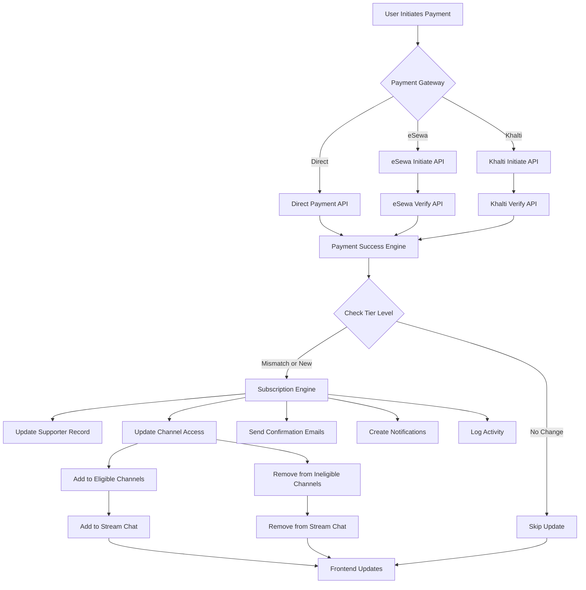
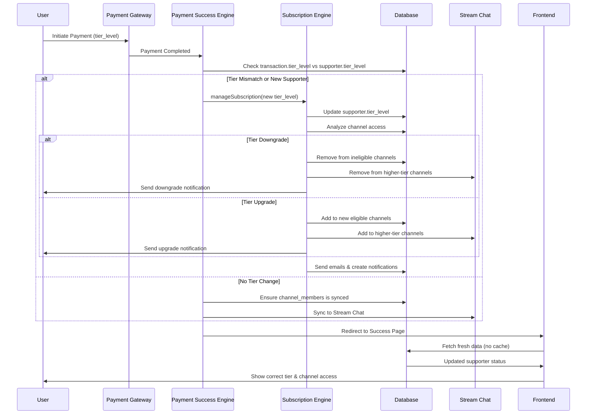

# MeroCircle - Architecture Documentation

## System Architecture Overview

MeroCircle follows a **modern full-stack architecture** using Next.js App Router, providing both server-side rendering (SSR) and client-side interactivity. The architecture is designed for scalability, maintainability, and performance.

## High-Level Architecture

```
┌─────────────────────────────────────────────────────────────┐
│                     Client (Browser)                        │
│  ┌──────────────┐  ┌──────────────┐  ┌──────────────┐     │
│  │   React App  │  │  React Query │  │   Contexts   │     │
│  │  Components  │  │   (Cache)    │  │  (State)     │     │
│  └──────────────┘  └──────────────┘  └──────────────┘     │
└─────────────────────────────────────────────────────────────┘
                            │
                            │ HTTP/HTTPS
                            │
┌─────────────────────────────────────────────────────────────┐
│              Next.js Application Server                      │
│  ┌──────────────────────────────────────────────────────┐  │
│  │              Next.js API Routes                      │  │
│  │  ┌──────────┐  ┌──────────┐  ┌──────────┐          │  │
│  │  │ Payment  │  │  Posts   │  │  Creator  │  ...     │  │
│  │  │   API    │  │   API    │  │    API    │          │  │
│  │  └──────────┘  └──────────┘  └──────────┘          │  │
│  └──────────────────────────────────────────────────────┘  │
│  ┌──────────────────────────────────────────────────────┐  │
│  │              Utility Layer (lib/)                   │  │
│  │  ┌──────────┐  ┌──────────┐  ┌──────────┐          │  │
│  │  │ API Utils│  │ Payment  │  │ Validation│          │  │
│  │  └──────────┘  └──────────┘  └──────────┘          │  │
│  └──────────────────────────────────────────────────────┘  │
└─────────────────────────────────────────────────────────────┘
                            │
        ┌───────────────────┼───────────────────┐
        │                   │                   │
┌───────▼──────┐  ┌─────────▼─────────┐  ┌────▼──────────┐
│   Supabase   │  │   Stream Chat      │  │   SendGrid    │
│  (Database + │  │   (Messaging)      │  │   (Email)     │
│    Auth +    │  │                    │  │               │
│   Storage)   │  │                    │  │               │
└──────────────┘  └────────────────────┘  └───────────────┘
        │
        │
┌───────▼──────────┐
│  Payment Gateways │
│  ┌──────┐ ┌─────┐│
│  │eSewa │ │Khalt││
│  └──────┘ └─────┘│
└──────────────────┘
```

## Frontend Architecture

### Component Hierarchy

```
App Layout
├── AuthProvider (Supabase Auth)
├── StreamChatProvider (Stream Chat)
├── DashboardProvider (Dashboard State)
├── QueryProvider (React Query)
└── PageLayout
    ├── DashboardLayout
    │   ├── ActivityBar (Navigation)
    │   ├── Main Content Area
    │   │   └── UnifiedDashboard
    │   │       ├── FeedSection
    │   │       ├── CreatorStudioSection
    │   │       ├── NotificationsSection
    │   │       └── ...
    │   └── RightPanel (Sidebar)
    └── Page Content
```

### State Management Strategy

#### 1. Server State (React Query)
- **Purpose**: Cache and manage server-fetched data
- **Location**: `hooks/useQueries.ts`
- **Features**:
  - Automatic caching
  - Background refetching
  - Optimistic updates
  - Query invalidation

#### 2. Global Client State (Context API)
- **Auth State**: `contexts/supabase-auth-context.tsx`
- **Chat State**: `contexts/stream-chat-context.tsx`
- **Dashboard State**: `contexts/dashboard-context.tsx`

#### 3. Local Component State
- **React Hooks**: `useState`, `useReducer`
- **Form State**: Controlled components
- **UI State**: Modal visibility, loading states

### Component Organization

Following **Atomic Design Principles**:

```
components/
├── atoms/              # Basic building blocks
│   ├── buttons/
│   ├── inputs/
│   ├── avatars/
│   └── badges/
├── molecules/          # Simple combinations
│   ├── forms/
│   ├── cards/
│   └── lists/
├── organisms/          # Complex components
│   ├── posts/
│   ├── notifications/
│   └── chat/
└── dashboard/          # Feature-specific
    └── sections/
```

## Backend Architecture

### API Route Structure

```
app/api/
├── auth/               # Authentication endpoints
├── creator/            # Creator-specific endpoints
│   ├── [id]/
│   ├── analytics/
│   └── supporters/
├── payment/            # Payment processing
│   ├── initiate/
│   ├── verify/
│   └── khalti/
├── posts/              # Post management
├── social/             # Social interactions
├── notifications/      # Notification system
└── stream/             # Stream Chat integration
```

### Request Flow

1. **Client Request** → Next.js API Route
2. **Authentication** → `getAuthenticatedUser()`
3. **Authorization** → `requireCreatorRole()` or resource ownership check
4. **Validation** → Input validation utilities
5. **Business Logic** → Database operations, third-party API calls
6. **Response** → JSON response with error handling

### Error Handling Pattern

```typescript
try {
  // Authentication
  const { user, errorResponse } = await getAuthenticatedUser();
  if (errorResponse) return errorResponse;

  // Authorization
  const { isCreator, errorResponse: roleError } = await requireCreatorRole(user.id);
  if (roleError) return roleError;

  // Business logic
  const result = await performOperation();

  return NextResponse.json(result);
} catch (error) {
  return handleApiError(error, 'CONTEXT', 'Default error message');
}
```

## Data Flow

### Reading Data

```
User Action
  ↓
React Component
  ↓
React Query Hook (useQueries.ts)
  ↓
API Route (app/api/*)
  ↓
Supabase Client
  ↓
PostgreSQL Database
  ↓
Response → Cache → Component Update
```

### Writing Data

```
User Action
  ↓
React Component
  ↓
React Query Mutation
  ↓
API Route
  ↓
Validation → Business Logic → Database
  ↓
Success/Error Response
  ↓
Cache Invalidation → UI Update
```

## Authentication Flow

```
1. User clicks "Sign in with Google"
   ↓
2. Supabase Auth redirects to Google OAuth
   ↓
3. Google callback → Supabase Auth
   ↓
4. Supabase creates/updates user session
   ↓
5. Middleware refreshes session
   ↓
6. AuthContext loads user profile
   ↓
7. User authenticated
```

## Payment & Subscription Architecture

### Unified Payment Flow (Gateway-Agnostic)



### Subscription Tier Management



### Engine Responsibilities

#### Payment Success Engine (`lib/payment-success-engine.ts`)
- **Purpose**: Gateway-agnostic payment recording
- **Responsibilities**:
  - Record transaction as completed
  - Extract `tier_level` from transaction (direct column)
  - Detect tier mismatches
  - Delegate to Subscription Engine for supporter updates
  - Update creator supporter counts
  - Sync to Stream Chat
- **Called by**: eSewa verify, Khalti verify, Direct payment, any future gateway

#### Subscription Engine (`lib/subscription-engine.ts`)
- **Purpose**: Manage supporter relationships and tier levels
- **Responsibilities**:
  - Create/update supporter records
  - Detect upgrades, downgrades, same-tier payments
  - Update `channel_members` (add to eligible, remove from ineligible)
  - Remove from Stream Chat on downgrade
  - Send confirmation emails (upgrade/downgrade specific)
  - Create notifications
  - Log activities
- **Called by**: Payment Success Engine, recurring subscription handlers, manual updates

#### Unsubscribe Engine (`lib/unsubscribe-engine.ts`)
- **Purpose**: Handle subscription cancellations
- **Responsibilities**:
  - Deactivate supporter record
  - Cancel recurring subscriptions
  - Remove from all channels
  - Remove from Stream Chat
  - Disable email notifications
  - Update creator counts
- **Called by**: User-initiated unsubscribe, email links, subscription webhooks

### eSewa Payment

```
1. Supporter initiates payment with tier_level
   ↓
2. POST /api/payment/initiate
   ↓
3. Generate transaction UUID
   ↓
4. Create eSewa signature
   ↓
5. Store pending transaction in DB with tier_level
   ↓
6. Return payment form data
   ↓
7. Redirect to eSewa payment page
   ↓
8. User completes payment
   ↓
9. eSewa redirects to success/failure URL
   ↓
10. GET /api/payment/verify
    ↓
11. Verify signature with eSewa API
    ↓
12. Call Payment Success Engine
    ↓
13. Engine checks tier_level and calls Subscription Engine
    ↓
14. Subscription Engine updates supporter, channels, Stream Chat
```

### Khalti Payment

```
1. Supporter initiates payment with tier_level
   ↓
2. POST /api/payment/khalti/initiate
   ↓
3. Generate purchase order ID
   ↓
4. Call Khalti API to initiate payment
   ↓
5. Store pending transaction with tier_level
   ↓
6. Redirect to Khalti payment page
   ↓
7. User completes payment
   ↓
8. Khalti redirects to callback
   ↓
9. GET /api/payment/khalti/verify
    ↓
10. Verify with Khalti lookup API
    ↓
11. Call Payment Success Engine
    ↓
12. Engine checks tier_level and calls Subscription Engine
    ↓
13. Subscription Engine updates supporter, channels, Stream Chat
```

### Direct Payment (Bypass Gateway)

```
1. Supporter initiates payment with tier_level
   ↓
2. POST /api/payment/direct
   ↓
3. Create transaction as completed with tier_level
   ↓
4. Call Payment Success Engine
   ↓
5. Engine checks tier_level and calls Subscription Engine
   ↓
6. Subscription Engine updates supporter, channels, Stream Chat
   ↓
7. Return success response
```

### Tier Change Handling

**Key Features**:
- `tier_level` stored as direct column in `supporter_transactions` (business logic, not gateway-specific)
- Payment Success Engine detects tier mismatches
- Subscription Engine handles both upgrades and downgrades
- Channel access updated automatically (database + Stream Chat)
- No caching on supporter status API (always fresh data)
- Frontend auto-refreshes after payment

**Upgrade Flow** (e.g., Tier 1 → Tier 2):
1. New transaction created with `tier_level: 2`
2. Payment Success Engine detects mismatch (supporter.tier_level: 1, transaction.tier_level: 2)
3. Calls Subscription Engine
4. Updates supporter record to tier 2
5. Adds supporter to tier 2 channels (keeps tier 1 channels)
6. Syncs to Stream Chat
7. Sends upgrade emails

**Downgrade Flow** (e.g., Tier 3 → Tier 2):
1. New transaction created with `tier_level: 2`
2. Payment Success Engine detects mismatch (supporter.tier_level: 3, transaction.tier_level: 2)
3. Calls Subscription Engine
4. Updates supporter record to tier 2
5. Removes supporter from tier 3-only channels
6. Removes from Stream Chat tier 3 channels
7. Keeps access to tier 1 and tier 2 channels
8. Sends downgrade notification

## Database Architecture

### Connection Strategy

- **Client-side**: Browser client for public data
- **Server-side**: Server client with service role for protected operations
- **Connection Pooling**: Managed by Supabase

### Query Patterns

1. **Simple Queries**: Direct Supabase queries
2. **Complex Queries**: Database functions (stored procedures)
3. **Real-time**: Supabase Realtime subscriptions
4. **Aggregations**: Database functions for performance

### Migration Strategy

- **Location**: `supabase/migrations/`
- **Naming**: `YYYYMMDDHHMMSS_description.sql`
- **Version Control**: All migrations in Git
- **Execution**: Manual via Supabase dashboard or CLI

## Caching Strategy

### React Query Cache

- **Stale Time**: 2-5 minutes for most queries
- **Cache Time**: 5-10 minutes
- **Refetch Interval**: Background refetching for notifications
- **Invalidation**: On mutations

### Next.js Caching

- **Static Pages**: ISR (Incremental Static Regeneration)
- **API Routes**: Dynamic by default
- **Images**: Optimized via Next.js Image

## Security Architecture

### Authentication Layers

1. **Supabase Auth**: JWT token-based
2. **Middleware**: Session refresh on every request
3. **API Routes**: Server-side authentication check
4. **Database RLS**: Row-level security policies

### Authorization Layers

1. **Role-based**: User vs Creator roles
2. **Resource Ownership**: Creator can only modify own resources
3. **Tier-based Access**: Content visibility based on supporter tier

### Data Protection

- **Input Sanitization**: All user inputs sanitized
- **SQL Injection**: Parameterized queries only
- **XSS Protection**: Content sanitization
- **CSRF**: SameSite cookies
- **Rate Limiting**: API rate limiting

## Performance Optimizations

### Frontend

- **Code Splitting**: Dynamic imports
- **Lazy Loading**: Component lazy loading
- **Virtualization**: React Window for lists
- **Memoization**: React.memo, useMemo, useCallback
- **Image Optimization**: Next.js Image component

### Backend

- **Database Indexing**: Optimized queries
- **Connection Pooling**: Supabase managed
- **Caching**: React Query cache
- **Batch Operations**: Bulk inserts/updates

## Scalability Considerations

### Horizontal Scaling

- **Stateless API**: All API routes are stateless
- **Database**: Supabase scales automatically
- **CDN**: Vercel Edge Network
- **Caching**: Distributed caching via React Query

### Vertical Scaling

- **Database**: Supabase managed scaling
- **API**: Vercel serverless functions auto-scale
- **Storage**: Supabase Storage scales

## Monitoring & Logging

### Logging Strategy

- **Client-side**: Console logs (development only)
- **Server-side**: Structured logging via `lib/logger.ts`
- **Error Tracking**: Error logging with context

### Monitoring Points

- API response times
- Database query performance
- Payment transaction success rates
- User authentication success rates

## Deployment Architecture

See `docs/04-DEPLOYMENT.md` for detailed deployment information.

---

## Related Documentation

For detailed information on specific systems, see:

- **[Subscription System](SUBSCRIPTION-SYSTEM.md)** - Complete guide to subscription management, tier changes, expiry tracking, and renewal flows
- **[Dodo Payments Integration](DODO-PAYMENTS-INTEGRATION.md)** - Visa/Mastercard payments via Dodo
- **[Third-Party Integrations](03-THIRD-PARTY-INTEGRATIONS.md)** - All external service integrations
- **[Database Schema](07-DATABASE-SCHEMA.md)** - Complete database documentation

---

**Last Updated**: February 2026
