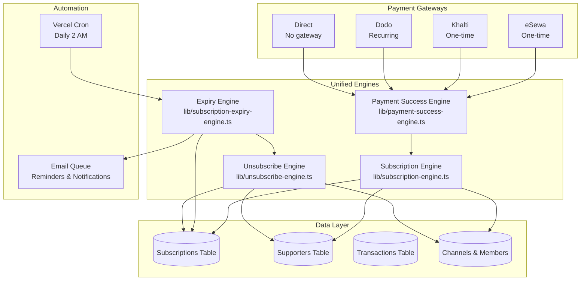
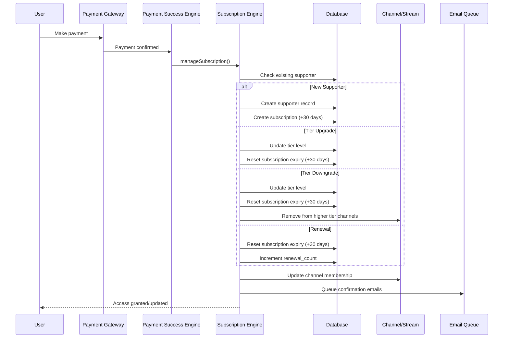

# Subscription System - Complete Documentation

## Table of Contents

1. [Overview](#overview)
2. [Architecture](#architecture)
3. [Payment Gateway Types](#payment-gateway-types)
4. [Subscription Engine](#subscription-engine)
5. [Expiry Management](#expiry-management)
6. [Tier Change Scenarios](#tier-change-scenarios)
7. [Email Notifications](#email-notifications)
8. [User Interface](#user-interface)
9. [API Endpoints](#api-endpoints)
10. [Database Schema](#database-schema)
11. [Integration with Other Engines](#integration-with-other-engines)
12. [Testing](#testing)
13. [Troubleshooting](#troubleshooting)

---

## Overview

The MeroCircle subscription system provides a unified, gateway-agnostic platform for managing creator subscriptions across multiple payment methods. It supports:

- **Three payment gateways**: eSewa, Khalti, and Dodo Payments (Visa/Mastercard)
- **Three tier levels**: One Star (Tier 1), Two Star (Tier 2), Three Star (Tier 3)
- **Flexible payment models**: One-time (eSewa/Khalti), recurring (Dodo), and direct support
- **Automatic expiry management**: 30-day cycles with reminders and auto-expiration
- **Channel access control**: Automatic tier-based access to creator channels
- **Tier flexibility**: Upgrades, downgrades, and renewals with proper expiry handling

### Key Principles

1. **Gateway-agnostic**: All gateways use the same unified engines
2. **Consistency**: Tier changes always reset the 30-day clock
3. **User-friendly**: Clear expiry dates, reminders, and easy renewal
4. **Idempotent**: Operations can be safely retried
5. **Comprehensive tracking**: Full transaction history and subscription lifecycle

---

## Architecture

### System Architecture



### Data Flow



---

## Payment Gateway Types

### Comparison Table

| Feature | eSewa | Khalti | Dodo | Direct |
|---------|-------|--------|------|--------|
| Payment Type | One-time | One-time | Recurring | No payment |
| Currency | NPR | NPR | USD (converted from NPR) | NPR |
| Subscription Period | 30 days | 30 days | Managed by Dodo | Permanent |
| Auto-renewal | ❌ Manual | ❌ Manual | ✅ Automatic | N/A |
| Expiry Tracking | ✅ Yes | ✅ Yes | ✅ Dodo handles | ❌ Never expires |
| Reminders | ✅ Days 28 & 29 | ✅ Days 28 & 29 | ✅ Dodo sends | ❌ N/A |
| Cancellation | Expires naturally | Expires naturally | API call to Dodo | Unsubscribe API |
| Tier Changes | ✅ Full support | ✅ Full support | ✅ Full support | ✅ Full support |

### Gateway-Specific Behavior

#### eSewa & Khalti (Pseudo-Subscriptions)

**How it works**:
1. User makes one-time payment → Gets 30 days of access
2. On Day 28 → System sends "2 days left" reminder email
3. On Day 29 → System sends "1 day left" reminder email
4. On Day 30 → Subscription expires, access revoked automatically
5. User can renew anytime with "Quick Renew" button

**Tier changes**:
- New payment always resets the 30-day clock
- If you upgrade on Day 15, your new expiry is Day 45 (not Day 30)

#### Dodo Payments (True Subscriptions)

**How it works**:
1. User subscribes → Dodo charges monthly automatically
2. Dodo sends webhooks for payment events
3. Our system processes webhooks through unified engines
4. User manages subscription via Dodo (cancel anytime)

**Tier changes**:
- Cancel old Dodo subscription
- Create new Dodo subscription at new tier
- Dodo handles recurring billing

#### Direct Payments

**How it works**:
1. User registers support without payment gateway
2. Access granted immediately
3. No expiry (permanent until manually unsubscribed)

---

## Subscription Engine

### Core Function: `manageSubscription()`

**Location**: [`lib/subscription-engine.ts`](lib/subscription-engine.ts)

**Purpose**: Unified engine for all subscription operations

### What It Does

1. **Determines Tier Level**:
   - From explicit `tierLevel` parameter (if provided)
   - Or by matching payment amount to tier prices

2. **Manages Supporter Records**:
   - Creates new supporter if first-time
   - Updates existing supporter on tier changes
   - Prevents duplicates via unique constraint
   - Handles upgrades/downgrades

3. **Channel Access Control**:
   - Adds supporter to eligible channels based on tier
   - Removes from channels they no longer qualify for (downgrades)
   - Syncs with Stream Chat

4. **Subscription Record Management**:
   - Creates or updates subscription records
   - Sets proper expiry dates (30 days from payment)
   - Tracks renewal count
   - Initializes reminder tracking for eSewa/Khalti

5. **Notifications**:
   - Creates in-app notifications
   - Queues confirmation emails (supporter + creator)
   - Logs support activity

### Function Signature

```typescript
export async function manageSubscription(
  params: SubscriptionParams
): Promise<SubscriptionResult>

interface SubscriptionParams {
  supporterId: string;
  creatorId: string;
  amount: number;
  tierLevel?: number;
  transactionId?: string;
  subscriptionId?: string;
  isRecurring?: boolean;
  cumulativeAmount?: boolean;
  paymentGateway?: 'esewa' | 'khalti' | 'dodo' | 'direct';
}
```

### Logic Flow

```mermaid
flowchart TD
    Start[manageSubscription called] --> DetermineTier[Determine Tier Level]
    DetermineTier --> CheckExisting[Check existing supporter]
    
    CheckExisting --> Exists{Supporter<br/>exists?}
    
    Exists -->|Yes| CompareT iers{Compare<br/>tiers}
    CompareT iers -->|Higher| Upgrade[UPGRADE:<br/>Update tier + channels]
    CompareT iers -->|Lower| Downgrade[DOWNGRADE:<br/>Update tier,<br/>remove channels]
    CompareT iers -->|Same| Renewal[RENEWAL:<br/>Reactivate/extend]
    
    Exists -->|No| NewSub[NEW:<br/>Create supporter]
    
    Upgrade --> ResetExpiry[Reset expiry: +30 days<br/>Reset reminders]
    Downgrade --> ResetExpiry
    Renewal --> ResetExpiry
    NewSub --> ResetExpiry
    
    ResetExpiry --> UpdateChannels[Update channel access]
    UpdateChannels --> SendEmails[Queue emails]
    SendEmails --> Done[Return success]
```

### Integration Points

The subscription engine is called by:

1. **Payment Success Engine** ([`lib/payment-success-engine.ts`](lib/payment-success-engine.ts))
   - After eSewa/Khalti/Direct payment verification
   - After Dodo webhook events
   
2. **Dodo Webhook Handler** ([`app/api/payment/dodo/webhook/route.ts`](app/api/payment/dodo/webhook/route.ts))
   - On `subscription.activated`
   - On `payment.succeeded`

3. **Direct Payment API** ([`app/api/payment/direct/route.ts`](app/api/payment/direct/route.ts))
   - For immediate access without gateway

---

## Expiry Management

### Expiry Engine

**Location**: [`lib/subscription-expiry-engine.ts`](lib/subscription-expiry-engine.ts)

**Purpose**: Automatically manage subscription expiry for eSewa/Khalti

### How It Works

The expiry engine runs daily (Vercel Cron at 2 AM UTC) and:

1. **Queries active eSewa/Khalti subscriptions** with `status='active'`
2. **Calculates days until expiry** for each subscription
3. **Takes appropriate action**:
   - Day 28: Queue 2-day reminder email
   - Day 29: Queue 1-day reminder email
   - Day 30+: Expire subscription and revoke access

### Expiry Timeline

```
Day 0: Payment received
  │
  ▼
Day 1-27: Active subscription
  │
  ▼
Day 28: 📧 "2 days until expiry" reminder sent
  │
  ▼
Day 29: 📧 "1 day until expiry" reminder sent
  │
  ▼
Day 30: ❌ Subscription expires
  │
  ├─→ Supporter deactivated
  ├─→ Removed from channels
  ├─→ Subscription status = 'expired'
  └─→ 📧 "Subscription expired" email sent
  │
  ▼
Day 30+: User can renew anytime (Quick Renew)
```

### Reminder Tracking

The `reminder_sent_at` JSONB field tracks which reminders have been sent:

```json
{
  "2_days": "2026-02-07T10:30:00Z",
  "1_day": "2026-02-08T10:30:00Z"
}
```

This prevents duplicate reminders if the expiry check runs multiple times.

### Scheduled Execution

**Vercel Cron Configuration** ([`vercel.json`](vercel.json)):

```json
{
  "crons": [{
    "path": "/api/subscriptions/check-expiry",
    "schedule": "0 2 * * *"
  }]
}
```

Runs daily at 2:00 AM UTC.

**Manual Trigger** (for testing):
```bash
curl http://localhost:3000/api/subscriptions/check-expiry
```

---

## Tier Change Scenarios

### Scenario 1: New Subscription

**User**: First-time supporter
**Action**: Pays NPR 500 for Tier 2

**What happens**:
```
1. Create supporter record:
   - supporter_id = user.id
   - creator_id = creator.id
   - tier_level = 2
   - amount = 500
   - is_active = true

2. Create subscription record:
   - supporter_id = user.id
   - creator_id = creator.id
   - tier_level = 2
   - amount = 500
   - payment_gateway = 'esewa'
   - status = 'active'
   - current_period_start = now
   - current_period_end = now + 30 days
   - reminder_sent_at = {}
   - renewal_count = 0

3. Add to channels:
   - All Supporters channel
   - Tier 2 channels

4. Send emails:
   - Supporter: "Subscription Confirmation"
   - Creator: "New Supporter Notification"
```

**Result**: User has 30 days of Tier 2 access

---

### Scenario 2: Tier Upgrade (Tier 1 → Tier 3)

**User**: Currently Tier 1 (expires Feb 10)
**Action**: Pays NPR 1000 for Tier 3 on Feb 5
**Current Date**: Feb 5

**What happens**:
```
1. Update supporter record:
   - tier_level: 1 → 3
   - amount: 100 → 1000

2. Update subscription record:
   - tier_level: 1 → 3
   - current_period_start: Feb 5
   - current_period_end: Mar 7 (30 days from Feb 5, NOT Feb 10!)
   - reminder_sent_at: {} (RESET)
   - renewal_count: 0 (unchanged, it's an upgrade not renewal)

3. Add to Tier 3 channels:
   - Already in Tier 1 & 2 channels
   - Now added to Tier 3 channels

4. Send emails:
   - "Subscription Confirmation" (celebrates upgrade)
```

**Result**: 
- User upgraded to Tier 3
- **NEW expiry date: Mar 7** (30 days from upgrade, not original Feb 10)
- Full access to all tier 1, 2, and 3 content

**Key Point**: The 30-day clock RESETS on upgrade. User gets full 30 days from their upgrade payment.

---

### Scenario 3: Tier Downgrade (Tier 3 → Tier 1)

**User**: Currently Tier 3 (expires Feb 20)
**Action**: Pays NPR 100 for Tier 1 on Feb 10
**Current Date**: Feb 10

**What happens**:
```
1. Update supporter record:
   - tier_level: 3 → 1
   - amount: 1000 → 100

2. Update subscription record:
   - tier_level: 3 → 1
   - current_period_start: Feb 10
   - current_period_end: Mar 12 (30 days from Feb 10, NOT Feb 20!)
   - reminder_sent_at: {} (RESET)
   - renewal_count: 0 (unchanged)

3. Remove from Tier 2 & 3 channels:
   - Database: DELETE from channel_members
   - Stream Chat: Remove via Stream API

4. Keep access to Tier 1 channels:
   - All Supporters channel

5. Send emails:
   - "Subscription Confirmation" (acknowledges downgrade)
```

**Result**:
- User downgraded to Tier 1
- **NEW expiry date: Mar 12** (30 days from downgrade)
- Lost access to Tier 2 & 3 content
- Kept access to Tier 1 content

**Key Point**: User gets 30 days at the new tier from their payment date.

---

### Scenario 4: Same-Tier Renewal

**User**: Tier 2 subscription expired on Feb 5
**Action**: Pays NPR 500 for Tier 2 again on Feb 7
**Current Date**: Feb 7

**What happens**:
```
1. Reactivate supporter record:
   - tier_level: 2 (unchanged)
   - is_active: false → true

2. Update subscription record:
   - tier_level: 2 (unchanged)
   - status: 'expired' → 'active'
   - current_period_start: Feb 7
   - current_period_end: Mar 9 (30 days from Feb 7)
   - reminder_sent_at: {} (RESET)
   - renewal_count: 0 → 1 (INCREMENTED)

3. Restore channel access:
   - Re-added to Tier 2 channels

4. Send emails:
   - "Subscription Confirmation" (welcomes back)
```

**Result**:
- Subscription renewed at Tier 2
- New 30-day period: Feb 7 - Mar 9
- Renewal count shows loyalty (1 renewal)
- Access restored to all Tier 2 content

**Key Point**: `renewal_count` tracks how many times user has renewed, showing loyalty.

---

## Email Notifications

### Email Types

#### 1. Subscription Confirmation
- **Sent to**: Supporter (after payment)
- **Trigger**: New subscription, upgrade, downgrade, or renewal
- **Template**: [`emails/templates/SubscriptionConfirmation.tsx`](emails/templates/SubscriptionConfirmation.tsx)
- **Content**:
  - Thank you message
  - Tier level and benefits
  - Amount paid
  - Link to creator page and chat

#### 2. New Supporter Notification
- **Sent to**: Creator (when they get a new supporter)
- **Trigger**: New subscription or upgrade
- **Template**: [`emails/templates/NewSupporterNotification.tsx`](emails/templates/NewSupporterNotification.tsx)
- **Content**:
  - Supporter name
  - Tier level
  - Amount received
  - Optional supporter message
  - Link to supporter management

#### 3. Subscription Expiring Reminder
- **Sent to**: Supporter (on days 28 & 29)
- **Trigger**: Expiry engine detects upcoming expiry
- **Template**: [`emails/templates/SubscriptionExpiringReminder.tsx`](emails/templates/SubscriptionExpiringReminder.tsx)
- **Content**:
  - Days until expiry (2 or 1)
  - Exact expiry date
  - List of access being lost
  - "Renew Now" button

#### 4. Subscription Expired Notification
- **Sent to**: Supporter (on day 30)
- **Trigger**: Expiry engine expires the subscription
- **Template**: [`emails/templates/SubscriptionExpiredNotification.tsx`](emails/templates/SubscriptionExpiredNotification.tsx)
- **Content**:
  - Confirmation that subscription has ended
  - Access has been revoked
  - "Renew Subscription" button

### Email Queue System

All emails go through the email queue ([`email_queue` table](supabase/migrations/20260131000001_email_queue_system.sql)):

```sql
CREATE TABLE email_queue (
  id UUID PRIMARY KEY,
  email_type TEXT CHECK (email_type IN (
    'welcome',
    'post_notification',
    'poll_notification',
    'payment_success',
    'payment_failed',
    'subscription_expiring_reminder',  -- NEW
    'subscription_expired'              -- NEW
  )),
  recipient_email TEXT NOT NULL,
  payload JSONB NOT NULL,
  status TEXT DEFAULT 'pending',
  attempts INTEGER DEFAULT 0,
  max_attempts INTEGER DEFAULT 3,
  scheduled_for TIMESTAMPTZ DEFAULT NOW(),
  processed_at TIMESTAMPTZ,
  created_at TIMESTAMPTZ DEFAULT NOW()
);
```

**Email processor**: [`app/api/email/process-queue/route.ts`](app/api/email/process-queue/route.ts)
- Runs via user activity trigger (no cron needed for emails)
- Processes 10 emails per batch
- Retries failed emails up to 3 times

---

## User Interface

### Settings → Subscriptions Tab

**Location**: [`components/settings/SubscriptionsManagement.tsx`](components/settings/SubscriptionsManagement.tsx)

**Features**:

#### Subscription Cards

Each subscription shows:
- ✅ Creator avatar and name
- ✅ Tier level and name
- ✅ Payment gateway badge (eSewa/Khalti/Dodo/Direct)
- ✅ Status badge:
  - 🟢 **Active** (7+ days remaining)
  - 🟡 **Expiring Soon** (<7 days remaining)
  - 🔴 **Expired** (past expiry date)
  - ⚪ **Cancelled**
- ✅ Amount paid (per month)
- ✅ Expiry date with countdown:
  - "Renews Feb 15 (15 days)"
  - "Expires Feb 15 (2 days)" (yellow warning)
  - "Expired Feb 15" (red)
- ✅ Renewal count (if > 0): "Renewed 3 times"

#### Action Buttons

1. **Renew Now** (for expired eSewa/Khalti only):
   - Shows for expired or expiring soon subscriptions
   - Redirects to creator page with pre-filled tier
   - One-click renewal flow

2. **Unsubscribe** (all subscriptions):
   - Opens confirmation dialog
   - Shows what access will be lost
   - Optional feedback textarea
   - Calls unsubscribe API

3. **View Creator**:
   - Links to creator's profile page
   - Quick navigation to see their content

### Unsubscribe Dialog

**Location**: [`components/settings/UnsubscribeDialog.tsx`](components/settings/UnsubscribeDialog.tsx)

**Flow**:
1. User clicks "Unsubscribe"
2. Dialog shows:
   - Creator name
   - Tier and amount
   - Warning about access loss (posts, chat, perks)
   - Optional feedback field
3. User confirms → API call → Access revoked
4. Dialog closes → Subscription list refreshes

---

## API Endpoints

### 1. Check Expiry (Automated)

**Endpoint**: `POST /api/subscriptions/check-expiry`
**Auth**: Cron secret required in production
**Purpose**: Run daily expiry checks

**Request**:
```bash
POST /api/subscriptions/check-expiry
Authorization: Bearer <CRON_SECRET>
```

**Response**:
```json
{
  "success": true,
  "duration": 1523,
  "result": {
    "checked": 15,
    "reminders_sent": 3,
    "expired": 1,
    "details": {
      "two_day_reminders": 2,
      "one_day_reminders": 1,
      "expired_subscriptions": 1
    },
    "errors": []
  }
}
```

### 2. My Subscriptions

**Endpoint**: `GET /api/subscriptions/my-subscriptions`
**Auth**: Required (authenticated user)
**Purpose**: Fetch all user's subscriptions

**Response**:
```json
{
  "success": true,
  "count": 2,
  "subscriptions": [
    {
      "id": "uuid",
      "creator": {
        "id": "uuid",
        "displayName": "Creator Name",
        "avatarUrl": "https://..."
      },
      "tier": {
        "level": 2,
        "name": "Two Star Supporter",
        "price": 500,
        "benefits": [...]
      },
      "amount": 500,
      "currency": "NPR",
      "paymentGateway": "esewa",
      "status": "active",
      "state": "expiring_soon",
      "currentPeriodEnd": "2026-02-15T00:00:00Z",
      "daysUntilExpiry": 5,
      "renewalCount": 2
    }
  ]
}
```

### 3. Quick Renew

**Endpoint**: `POST /api/subscriptions/quick-renew`
**Auth**: Required
**Purpose**: Prepare renewal with saved preferences

**Request**:
```json
{
  "subscription_id": "uuid"
}
```

**Response**:
```json
{
  "success": true,
  "renewal": {
    "subscriptionId": "uuid",
    "amount": 500,
    "tierLevel": 2,
    "creatorId": "uuid",
    "supporterId": "uuid",
    "gateway": "esewa",
    "paymentUrl": "https://merocircle.app/api/payment/initiate"
  },
  "message": "Renewal parameters prepared. Redirect user to payment."
}
```

**Frontend action**: Redirect to creator page with `?renew=true&tier=2`

### 4. Unsubscribe

**Endpoint**: `POST /api/subscriptions/unsubscribe`
**Auth**: Required
**Purpose**: Cancel subscription and revoke access

**Request**:
```json
{
  "subscription_id": "uuid",
  "feedback": "Optional feedback text"
}
```

**Response**:
```json
{
  "success": true,
  "message": "Successfully unsubscribed",
  "result": {
    "supporterDeactivated": true,
    "subscriptionCancelled": true,
    "channelsRemoved": 3
  }
}
```

**What it does**:
1. Verifies user owns the subscription
2. For Dodo: Cancels via Dodo API first
3. Calls `processUnsubscribe` engine
4. Deactivates supporter record
5. Updates subscription status to 'cancelled'
6. Removes from all creator channels
7. Sends confirmation email

---

## Database Schema

### Subscriptions Table

**Purpose**: Track subscription lifecycle and expiry

```sql
CREATE TABLE subscriptions (
  id UUID PRIMARY KEY DEFAULT uuid_generate_v4(),
  supporter_id UUID REFERENCES users(id) NOT NULL,
  creator_id UUID REFERENCES users(id) NOT NULL,
  tier_id UUID REFERENCES subscription_tiers(id) NOT NULL,
  tier_level INTEGER CHECK (tier_level IN (1, 2, 3)),
  amount NUMERIC CHECK (amount >= 0),
  currency TEXT DEFAULT 'NPR',
  
  -- Payment gateway
  payment_gateway TEXT CHECK (payment_gateway IN ('dodo', 'esewa', 'khalti', 'direct')),
  
  -- Status
  status TEXT DEFAULT 'active' CHECK (status IN ('active', 'cancelled', 'expired', 'pending', 'failed')),
  billing_cycle TEXT DEFAULT 'monthly' CHECK (billing_cycle IN ('monthly', 'yearly')),
  
  -- Period tracking
  current_period_start TIMESTAMPTZ,
  current_period_end TIMESTAMPTZ,
  
  -- Expiry management (for eSewa/Khalti)
  reminder_sent_at JSONB DEFAULT '{}',
  renewal_count INTEGER DEFAULT 0,
  auto_renew BOOLEAN DEFAULT false,
  
  -- External IDs (for Dodo)
  external_subscription_id VARCHAR(255),
  external_customer_id VARCHAR(255),
  
  -- Metadata
  metadata JSONB DEFAULT '{}',
  cancelled_at TIMESTAMPTZ,
  created_at TIMESTAMPTZ DEFAULT NOW(),
  updated_at TIMESTAMPTZ DEFAULT NOW(),
  
  -- Unique constraint
  UNIQUE(supporter_id, creator_id)
);
```

**Key Indexes**:
```sql
-- For expiry checks
CREATE INDEX idx_subscriptions_expiry 
ON subscriptions(current_period_end, status, payment_gateway)
WHERE status = 'active' AND payment_gateway IN ('esewa', 'khalti');

-- For user queries
CREATE INDEX idx_subscriptions_supporter_status
ON subscriptions(supporter_id, status, current_period_end DESC);
```

### Supporters Table

**Purpose**: Track supporter relationship and tier level

```sql
CREATE TABLE supporters (
  id UUID PRIMARY KEY,
  supporter_id UUID REFERENCES users(id) NOT NULL,
  creator_id UUID REFERENCES users(id) NOT NULL,
  tier_level INTEGER DEFAULT 1 CHECK (tier_level IN (1, 2, 3)),
  amount NUMERIC DEFAULT 0,
  is_active BOOLEAN DEFAULT true,
  subscription_id UUID REFERENCES subscriptions(id),
  created_at TIMESTAMPTZ DEFAULT NOW(),
  updated_at TIMESTAMPTZ DEFAULT NOW(),
  
  -- Unique constraint
  UNIQUE(supporter_id, creator_id)
);
```

### Transactions Table

**Purpose**: Track all payment transactions

```sql
CREATE TABLE supporter_transactions (
  id UUID PRIMARY KEY,
  supporter_id UUID REFERENCES users(id),
  creator_id UUID REFERENCES users(id),
  amount NUMERIC CHECK (amount > 0),
  currency VARCHAR(3) DEFAULT 'NPR',
  payment_method VARCHAR(20) CHECK (payment_method IN ('esewa', 'khalti', 'dodo', 'direct')),
  status VARCHAR(20) DEFAULT 'pending' CHECK (status IN ('pending', 'completed', 'failed')),
  tier_level INTEGER CHECK (tier_level IN (1, 2, 3)),
  transaction_uuid VARCHAR(255) UNIQUE,
  metadata JSONB DEFAULT '{}',
  created_at TIMESTAMPTZ DEFAULT NOW()
);
```

---

## Integration with Other Engines

### 1. Payment Success Engine

**File**: [`lib/payment-success-engine.ts`](lib/payment-success-engine.ts)

**Calls subscription engine**:
```typescript
const subscriptionResult = await manageSubscription({
  supporterId: transaction.supporter_id,
  creatorId: transaction.creator_id,
  amount: transactionAmount,
  tierLevel: extractedTierLevel,
  transactionId: transaction.id,
  isRecurring: false,
  cumulativeAmount: false,
  paymentGateway: paymentMethod, // 'esewa', 'khalti', 'dodo', or 'direct'
});
```

**Flow**:
1. Verifies payment with gateway
2. Updates transaction status to 'completed'
3. Calls subscription engine to manage supporter/subscription
4. Returns success

### 2. Unsubscribe Engine

**File**: [`lib/unsubscribe-engine.ts`](lib/unsubscribe-engine.ts)

**Called by**:
- Expiry engine (when subscription expires)
- Manual unsubscribe API
- Dodo webhook (on cancellation)

**What it does**:
```typescript
await processUnsubscribe({
  supporterId: 'uuid',
  creatorId: 'uuid',
  reason: 'expired', // or 'user_cancelled'
  sendEmail: true,
  feedback: 'Optional feedback'
});
```

**Actions**:
1. Deactivates supporter record (`is_active = false`)
2. Updates subscription status to 'cancelled' or 'expired'
3. Removes from all creator channels (DB + Stream Chat)
4. Optionally sends unsubscribe confirmation email
5. Logs activity

### 3. Channel Management Engine

**File**: [`lib/stream-channel-engine.ts`](lib/stream-channel-engine.ts)

**Integration**:
- Subscription engine calls channel functions to add/remove members
- Syncs database `channel_members` with Stream Chat
- Handles both upgrades (add) and downgrades (remove)

### 4. Notification Engine

**File**: [`lib/notification-engine.ts`](lib/notification-engine.ts)

**Integration**:
- Creates in-app notifications for subscription events
- Notification types: 'support' (new subscription), 'payment' (transaction)

### 5. Activity Logging Engine

**File**: [`lib/activity-logging-engine.ts`](lib/activity-logging-engine.ts)

**Integration**:
- Logs 'support_given' activity on new subscriptions
- Tracks supporter journey for analytics

---

## Code Architecture

### Engine Hierarchy

```
Payment Success Engine (gateway-agnostic entry point)
    ↓
Subscription Engine (manages supporter + subscription + channels)
    ↓
    ├─→ Channel Management Engine (add/remove from channels)
    ├─→ Notification Engine (create in-app notifications)
    ├─→ Activity Logging Engine (log support activity)
    └─→ Email functions (queue confirmation emails)
```

### Expiry Check Flow

```
Vercel Cron (daily 2 AM)
    ↓
Expiry Check API
    ↓
Expiry Engine
    ↓
    ├─→ Check days until expiry
    ├─→ Day 28: Queue 2-day reminder
    ├─→ Day 29: Queue 1-day reminder
    └─→ Day 30+: Unsubscribe Engine
            ↓
            ├─→ Deactivate supporter
            ├─→ Cancel subscription
            ├─→ Remove from channels
            └─→ Queue expired email
```

### Unsubscribe Flow

```
User clicks "Unsubscribe"
    ↓
Unsubscribe Dialog (confirmation)
    ↓
Unsubscribe API
    ↓
    ├─→ For Dodo: Cancel via Dodo API
    └─→ Call Unsubscribe Engine
            ↓
            ├─→ Deactivate supporter
            ├─→ Cancel subscription
            ├─→ Remove from channels (DB + Stream)
            └─→ Send confirmation email
```

---

## Testing

### Automated Testing

**Script**: [`scripts/test-subscription-expiry.ts`](scripts/test-subscription-expiry.ts)

**Run**:
```bash
npx tsx scripts/test-subscription-expiry.ts
```

**What it tests**:
1. Creates test users (supporter + creator)
2. Creates test subscriptions with various expiry dates
3. Triggers expiry check manually
4. Verifies reminder emails are queued
5. Verifies subscriptions are expired correctly
6. Cleans up test data

### Manual Testing

#### Test 1: New Subscription
1. Go to creator page
2. Select Tier 2, pay via eSewa
3. Verify in Settings → Subscriptions:
   - Shows as "Active"
   - Expiry date is +30 days from now
   - Renewal count = 0

#### Test 2: Tier Upgrade
1. Currently Tier 1, pay for Tier 3
2. Verify:
   - Tier level updated to 3
   - **Expiry date RESET** to +30 days from upgrade
   - Can access Tier 3 channels
   - Renewal count unchanged

#### Test 3: Tier Downgrade
1. Currently Tier 3, pay for Tier 1
2. Verify:
   - Tier level updated to 1
   - **Expiry date RESET** to +30 days from downgrade
   - Removed from Tier 2 & 3 channels
   - Can still access Tier 1 content

#### Test 4: Expiry Reminders
1. Manually set subscription to expire in 2 days (update DB)
2. Trigger expiry check: `GET /api/subscriptions/check-expiry`
3. Check email queue for queued reminder
4. Wait 1 day, trigger again
5. Verify 1-day reminder queued

#### Test 5: Auto-Expiry
1. Manually set subscription to expire yesterday (update DB)
2. Trigger expiry check
3. Verify:
   - Subscription status = 'expired'
   - Supporter is_active = false
   - Removed from channels
   - Expired email queued

#### Test 6: Renewal
1. Let subscription expire (or manually expire in DB)
2. In Settings → Subscriptions, click "Renew Now"
3. Complete payment
4. Verify:
   - Status = 'active'
   - New expiry date = +30 days from renewal
   - Renewal count incremented
   - Access restored

---

## Troubleshooting

### Issue 1: Subscription not expiring

**Symptoms**: Subscription past expiry date but still active

**Possible causes**:
1. Cron not running → Check Vercel cron logs
2. `current_period_end` not set → Check subscription record in DB
3. `payment_gateway` not 'esewa' or 'khalti' → Check DB value

**Fix**:
```bash
# Manually trigger expiry check
curl https://merocircle.app/api/subscriptions/check-expiry
```

### Issue 2: Duplicate reminders sent

**Symptoms**: User receives same reminder multiple times

**Possible causes**:
- `reminder_sent_at` not being updated after sending

**Fix**:
```sql
-- Check reminder status
SELECT id, reminder_sent_at, current_period_end 
FROM subscriptions 
WHERE supporter_id = 'uuid';

-- Reset reminders if needed
UPDATE subscriptions 
SET reminder_sent_at = '{}' 
WHERE id = 'uuid';
```

### Issue 3: Expiry date not resetting on tier change

**Symptoms**: User upgrades but expiry date stays the same

**Possible causes**:
- Old code that didn't handle tier changes properly

**Fix**: This is now fixed in the updated subscription engine. The expiry date always resets to +30 days on any payment.

### Issue 4: User not removed from channels on downgrade

**Symptoms**: User downgraded but still has access to higher tier channels

**Possible causes**:
- Channel removal logic not executing
- Stream Chat sync failed

**Fix**: Check logs for channel removal errors. The subscription engine now explicitly removes users from ineligible channels.

### Issue 5: Vercel Cron not running

**Symptoms**: No reminders or expiries being processed

**Possible causes**:
1. Cron not configured in Vercel
2. `CRON_SECRET` not matching

**Fix**:
1. Check `vercel.json` has cron configuration
2. Set `CRON_SECRET` in Vercel environment variables
3. Check Vercel deployment logs for cron execution
4. Alternative: Trigger manually for testing

---

## Environment Variables

### Required

```bash
# Database
NEXT_PUBLIC_SUPABASE_URL=your-supabase-url
SUPABASE_SERVICE_ROLE_KEY=your-service-key

# App
NEXT_PUBLIC_APP_URL=https://merocircle.app

# Email (for notifications)
SMTP_HOST=smtp.hostinger.com
SMTP_PORT=587
SMTP_USER=your-email
SMTP_PASSWORD=your-password

# Cron (for scheduled tasks)
CRON_SECRET=your-secret-for-cron-auth

# Unsubscribe tokens
UNSUBSCRIBE_SECRET=your-secret-for-unsubscribe-tokens
```

### Payment Gateway Specific

```bash
# eSewa
ESEWA_MERCHANT_CODE=your-merchant-code
ESEWA_SECRET_KEY=your-secret-key

# Khalti
KHALTI_SECRET_KEY=your-secret-key
NEXT_PUBLIC_KHALTI_PUBLIC_KEY=your-public-key

# Dodo
DODO_PAYMENTS_API_KEY=your-api-key
DODO_PAYMENTS_WEBHOOK_KEY=your-webhook-key
DODO_PAYMENTS_ENVIRONMENT=test_mode
```

---

## Best Practices

### 1. Always Reset Expiry on Payment

Every new payment (upgrade, downgrade, renewal) should reset the 30-day clock:

```typescript
// Good ✅
subscriptionData.current_period_end = new Date(Date.now() + 30 * 24 * 60 * 60 * 1000).toISOString();

// Bad ❌ - Don't keep old expiry date
subscriptionData.current_period_end = existingSubscription.current_period_end;
```

### 2. Reset Reminder Tracking on Payment

Clear `reminder_sent_at` so users get fresh reminders:

```typescript
// Good ✅
subscriptionData.reminder_sent_at = {};

// Bad ❌ - Don't keep old reminders
subscriptionData.reminder_sent_at = existingSubscription.reminder_sent_at;
```

### 3. Track Renewal vs Tier Change

Only increment `renewal_count` on same-tier renewals:

```typescript
const isTierChange = existingSubscription.tier_level !== tierLevel;
const isRenewal = !isTierChange && existingSubscription.status === 'expired';

if (isRenewal) {
  subscriptionData.renewal_count = (existingSubscription.renewal_count || 0) + 1;
} else {
  subscriptionData.renewal_count = existingSubscription.renewal_count || 0;
}
```

### 4. Always Pass Payment Gateway

Ensure `paymentGateway` is passed to subscription engine:

```typescript
await manageSubscription({
  // ... other params
  paymentGateway: 'esewa', // ✅ Always include
});
```

### 5. Handle Channel Access on Downgrades

Explicitly remove users from channels they no longer qualify for:

```typescript
// The subscription engine now does this automatically
// But verify in logs that channel removal happens
```

### 6. Use Idempotent Operations

All subscription operations should be safe to retry:
- Upsert instead of insert (for supporters)
- Check before remove (for channels)
- Track reminder sending to prevent duplicates

---

## Summary

The subscription system provides:

✅ **Unified management** across all payment gateways
✅ **Automatic expiry tracking** for eSewa/Khalti (30-day cycles)
✅ **Smart tier changes** with expiry resets
✅ **Timely reminders** (days 28 & 29 before expiry)
✅ **Automatic access revocation** on expiry
✅ **User-friendly interface** to manage subscriptions
✅ **Quick renewal** for expired subscriptions
✅ **Confirmation dialogs** for unsubscribe actions
✅ **Comprehensive logging** for debugging
✅ **Email notifications** at every step
✅ **Gateway-agnostic** architecture for easy expansion

### Key Takeaway

**Every payment resets the 30-day clock**, whether it's:
- A new subscription
- An upgrade to a higher tier
- A downgrade to a lower tier
- A renewal at the same tier

This ensures users always get full value (30 days) from every payment they make.
